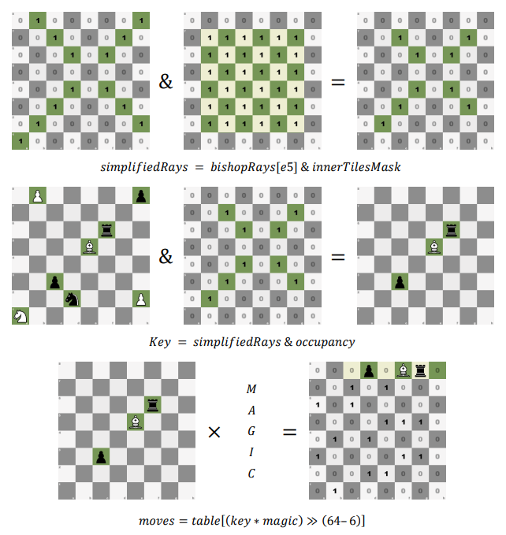

# NNUE-Bitboard-Chess-Engine
This is a bitboard chess engine that uses an NNUE model for node evaluation inside a PVS search. 
For more information on this current project and other techniques concerning chess engines see my [bsc dissertation](./dissertation.pdf) (written in greek).

# Build info
Compiled with: cmake CMakeLists -> make

NNUE file should be at the same folder with the executable.
If the program crashes due to unknown cpu instructions the appropriate intrisics
should be disabled within the CMakeLists file. 

Possible options: USE_SSE41 USE_SSE3 USE_SSE2 USE_SSE USE_AVX2. The more instructions supported the better the speed (search nps)

# Bitboards
Bitboards (bitmaps) are used to represent various states and piece positions within the chess board. 
They utilise the fact that a uint_64 has excactly as many bits as we need to represent an 8x8 chess board. 
This method offers great computational speed when run in 64 bit architectures where 64 bit registers can be used.
When we want to add remove ot check anything within our set all we have to do is use binary operators.

eg: We can enable the i-th position of board A by doing A |= (1L << i). 
These basic operations are abstracted within a bitboard class.

# Move generation
We differentiate between two move categories. Pseudo moves and legal moves.
A pseudo move is a move that is legal in isolation but might not protect against a check or let the king be checked. 
We firstly generate Pseudo moves and filter them afterwards.

We differentiate between two piece categories. Leaper pieces and sliding pieces.
- Leaper pieces : pawns , king , knights
- Sliding pieces : queen , rook , bishop

Attack / move tables are pre-generated at startup. This way we can get all the possible pseudo moves for a given position without needing to calculate them on the fly.
For slider pieces pre-calculated magic numbers are used (magic bitboards technique)

Eg: In the following example we create a custom mask for the bishop rays at the position e5. We then filter the relevant
tiles from the occupancy board from said position to find the blocker pieces. By multiplying by a magic number
we can flatten the diagonal to be used as a key to a precalculated move table.

  

Exception: pawn pushes are calculated on the spot due to their simplicity and strong correlation to the occupancy bitboards when calculating double pushes on the 2nd or 7th ranks.
A pseudo move is considered legal if, after being applied, it leaves no checks. This assume we apply the move to a temporary copy of the current state which is later discarded.

# Move search
To find the optimal move a PVS implementation is used. The following optimization are included:
- null move prunning
- futility pruning
- move ordering
- transpotion tables with zobrist keys
- ab pruning
- late move pruning
- static null move pruning
- check extension

# UCI
The engine supports the basic UCI commands so it can be used inside GUI apps.

- ucinewgame // Starts a new game (required by the protocol) 
- position fen [fen string] // Sets a [fen] position
- position default // Sets the default position
- go depth [n] // Searches for the best move with depth [n].
- quit // Quits the program

More info on the UCI protocol can be read here http://wbec-ridderkerk.nl/html/UCIProtocol.html

# Fen strings

 Fen strings describe a board state, whose turn it is, if en passant is available, castling rights, piece positions and half/full move counters. 
 
 Default fen string: rnbqkbnr/pppppppp/8/8/8/8/PPPPPPPP/RNBQKBNR w KQkq - 0 1

# Dependencies
This engine uses the NNUE-probe library as a submodule. Furthermore the model file is required. 

Note: the library only works with older model types. File nn-62ef826d1a6d.nnue was tested. Various model files can be downloaded from https://tests.stockfishchess.org/nns
